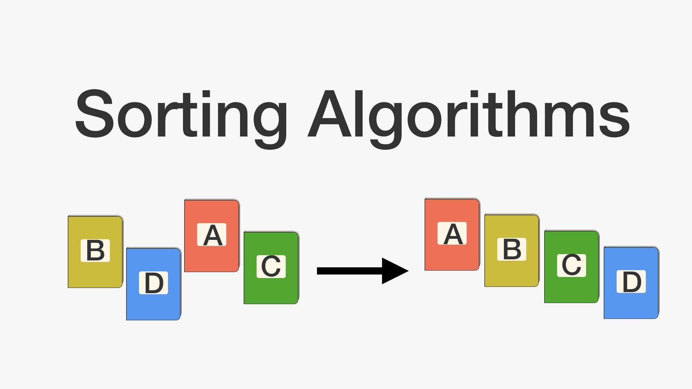
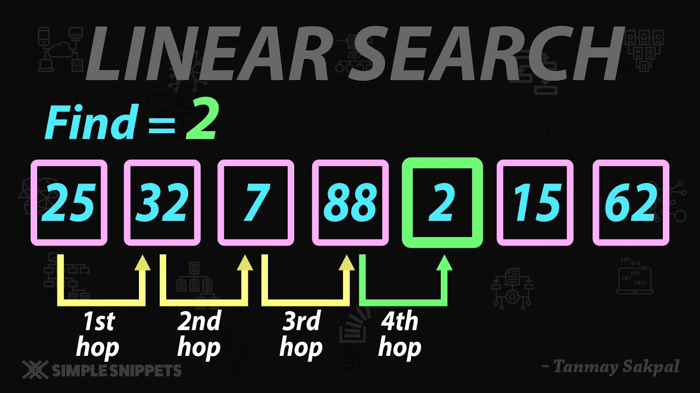

<h1>Searching and Sorting Library</h1>

This project is a C library that provides basic searching and sorting functionalities for integer arrays. The library includes implementations for various sorting algorithms such as Bubble Sort, Insertion Sort, and Selection Sort, as well as searching algorithms like Linear Search and Binary Search.

<h2>Project Structure</h2>
<ul>
    <li><code>README.md</code>: Documentation of the project.</li>
    <li><code>lib_searching.lib</code>: Compiled library for searching functions.</li>
    <li><code>lib_sorting.lib</code>: Compiled library for sorting functions.</li>
    <li><code>main.c</code>: Main file containing the implementation of the program.</li>
    <li><code>main.exe</code>: Executable file generated after compiling.</li>
    <li><code>main.o</code>: Object file generated from <code>main.c</code>.</li>
    <li><code>searching.h</code>: Header file for searching functions.</li>
    <li><code>searching.o</code>: Object file for searching functions.</li>
    <li><code>searchingImpl.c</code>: Implementation file for searching functions.</li>
    <li><code>sorting.h</code>: Header file for sorting functions.</li>
    <li><code>sorting.o</code>: Object file for sorting functions.</li>
    <li><code>sortingImpl.c</code>: Implementation file for sorting functions.</li>
</ul>

<h2>Usage</h2>

To use this library, follow these steps:

<ol>
    <li>Clone the repository.</li>
    <li>Compile the code using a C compiler. Example:</li>
    <pre><code>gcc main.c sortingImpl.c searchingImpl.c -o main -L. -l_searching -l_sorting</code></pre>
    <li>Run the executable:</li>
    <pre><code>./main</code></pre>
</ol>

<h2>Functions Overview</h2>

<h3>Sorting Functions</h3>
<ul>
    
    <li><code>void bubble_sort(int *arr, int n);</code></li>
    <li><code>void insertion_sort(int *arr, int n);</code></li>
    <li><code>void selection_sort(int *arr, int n);</code></li>
</ul>

<h3>Searching Functions</h3>
<ul>
    
    <li><code>int linear_search(int *arr, int n, int target);</code></li>
    <li><code>int binary_search(int *arr, int n, int target);</code></li>
</ul>

<h2>Example Code</h2>
<pre><code>#include &lt;stdio.h&gt;
#include &lt;stdlib.h&gt;
#include &lt;stdbool.h&gt;
#include "sorting.h"
#include "searching.h"

void start();
void init();
void searching();
void sorting();
void print(int *arr, int n);
void choices();

int n;
int arr[100];

int main() {
    start();
    return 0;
}</code></pre>
